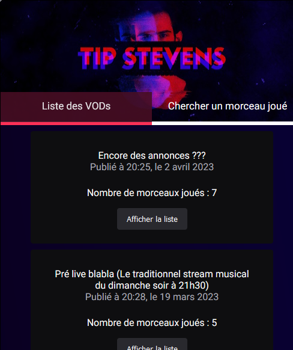
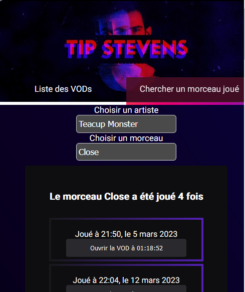
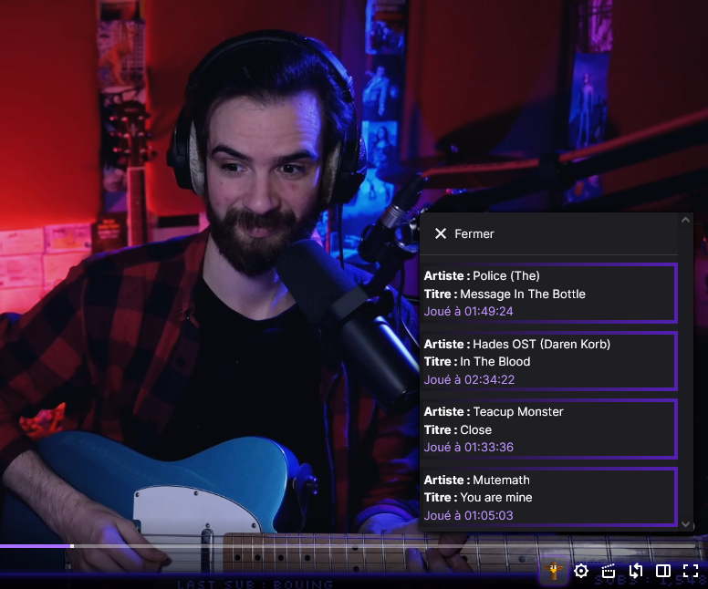

  
  
	<h3 align="center">Tip4Search</h3>  
	
  
		Extention destiné à la communauté du streamer Twitch TipStevens
		   
		Permet de retrouver la liste des morceaux joués lors des streams du dimanche  
	  <br/ >
		<a href="https://github.com/carage34/Tip4Search-extension/issues/new">Signaler un bug</a>  
	
  

  

# Sommaire  
  
- [Téléchargement et installation](#téléchargement-et-installation)  
- [Les fonctionnalités](#les-fonctionnalités)  

# Téléchargement et installation

## <b>Pour Firefox</b>

L'extension est à installer depuis le site d'addon Mozilla : <a href="https://addons.mozilla.org/fr/firefox/addon/tip4search/">https://addons.mozilla.org/fr/firefox/addon/tip4search/</a>

## <b>Pour Google Chrome</b>

Télécharger la dernière release dans la <a href="https://github.com/carage34/Tip4Search-extension/releases/tag/1.0.0">section release</a> 
Dézipper le fichier Tip4Search.zip. 
Vous devez installer l'extension manuellement.

- Aller dans "Gérer les extensions" (**chrome://extensions/** dans chrome)
- Vérifier que le  **Mode développeur** est activé
- Cliquez sur **Charger l'extension décompressé** et selectionnez le dossier précédemment dézippé.

# Les fonctionnalités

### <b>Dans l'extension</b>
<li>
<ul>
Liste des morceaux joués lors des streams du dimanche avec redirection vers la VOD au moment précis
Recherche d'un morceau joué dans toutes les VODs du dimanche
</ul>
</li>

### Sur Twitch

<li>
<ul>
Totem ajouté dans la barre du lecteur qui permet d'afficher les morceaux joués dans la VOD.
</ul>
</li>

